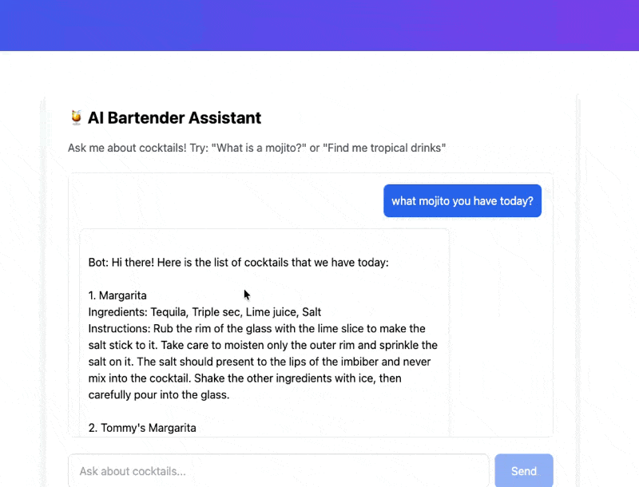

# Mocktailverse — Serverless RAG on AWS Bedrock

> 🟦 **L2 Action** in the [L1→L3 healthcare AI platform](https://gozeroshot.dev) — Truth → Features → Signals → Actions → Human adoption. This repo = a serverless RAG + agent platform on AWS Bedrock, using cocktail recipes as a safe public stand-in for enterprise data.



> **Demo status:** the live AWS stack is **torn down to keep cost at $0** between interviews. The GIF above is real proof-of-work from the deployed MVP; the whole stack is one `terraform apply` away (see [DEPLOYMENT.md](DEPLOYMENT.md)). No live link is shown rather than ship a dead one.

A production-shaped GenAI data platform: semantic search, grounded RAG, and agent-style tool calling — all serverless, all on AWS Bedrock.

---

## Repo Map

What each folder does and whether it's wired into the deployed stack:

```
mocktailverse-bedrock/
│
├── lambdas/          ✅ the GenAI runtime — 6 Python Lambdas
│   ├── ingest/       ✅ pull recipes + Titan enriches metadata → DynamoDB
│   ├── embed/        ✅ Titan v2 embeddings (1024-dim) for each recipe
│   ├── search/       ✅ semantic search over DynamoDB
│   ├── rag/          ✅ retrieve top-K → grounded answer (refuses if no context)
│   ├── agent/        ✅ tool-calling agent: search tool + Titan
│   └── search_tool/  ✅ the callable search tool the agent uses
├── infra/terraform/  ✅ all 34 AWS resources (S3, DynamoDB, Lambdas, API GW, EventBridge)
├── frontend/         ✅ Next.js 14 chat + search UI (deploys to S3 + CloudFront)
├── scripts/          ✅ benchmark.py — local latency harness + results
├── data/             ✅ seed recipes + DynamoDB schema + test payloads
├── workflows/        📖 notes on the planned Step Functions orchestration (not built yet)
├── ARCHITECTURE.md   📖 system design + diagrams (the "why")
├── DEPLOYMENT.md     📖 deploy steps + teardown
└── README.md         📖 you are here
```

---

## Overview

Mocktailverse turns a recipe corpus into an intelligent search + Q&A system:

- **Semantic search** — meaning, not keywords (`"refreshing summer drinks"` → mojitos, spritzers)
- **Grounded RAG** — answers built only from retrieved recipes; refuses when context is missing
- **Tool-calling agent** — searches DynamoDB before answering, so replies are data-driven
- **Event-driven + serverless** — Lambda + EventBridge, scales to zero, ~$1.56/month when live

**Stack:** AWS Lambda · Bedrock (Titan Text Lite + Titan Embeddings v2) · DynamoDB · API Gateway · EventBridge · CloudFront · Terraform · Next.js 14

---

## Architecture

```
External recipe API
        │
        ▼
   ingest Lambda ──(Titan enrich)──► DynamoDB (metadata)
        ▲                                  │
   EventBridge (daily)              embed Lambda (Titan v2, 1024-dim)
                                           │
                                           ▼
        ┌──────────────── API Gateway ────────────────┐
        ▼                  ▼                            ▼
   search Lambda      rag Lambda                  agent Lambda
   (semantic)     (retrieve→ground→answer)   (search tool + Titan)
        │                  │                            │
        └──────────────────┴────────────────────────────┘
                           ▼
              Next.js 14 frontend (S3 + CloudFront CDN)
```

Full design + diagrams: [ARCHITECTURE.md](ARCHITECTURE.md).

---

## Why This Matters — Traditional ETL vs GenAI Data Engineering

| Old Way (ETL) | New Way (GenAI) |
|---------------|-----------------|
| Batch jobs on schedules | Event-driven processing |
| SQL transformations | LLM-powered enrichment |
| Keyword search (`LIKE '%mojito%'`) | Semantic vector search |
| Static dashboards | Conversational agents |
| Manual data-quality checks | Grounded, refuse-on-empty answers |
| Relational only | Vector + NoSQL (DynamoDB) |

Same architecture, cocktail domain instead of enterprise data so it's public-safe.

---

## Key Features

### 1. AI-powered ingestion
Pull recipes from an external API, use **Bedrock Titan Text Lite** to extract/enrich metadata (flavor profile, tasting notes, categories), store in DynamoDB.

### 2. Semantic search
Encode each recipe with **Bedrock Titan Embeddings v2 (1024-dim)**, search by meaning over DynamoDB.

### 3. Grounded RAG
Embed the question → retrieve top-K recipes → build context → answer **only** from that context with Titan at `temperature 0.3`. **If retrieval returns nothing, the endpoint returns `"I don't know"` instead of guessing** (`grounded: false`).

### 4. Tool-calling agent
A conversational endpoint that calls a **`search_cocktails`** tool against DynamoDB before answering, so responses are backed by real rows.
> A managed AWS Bedrock Agent is scaffolded (alias wired in code) but currently **disabled** (`AGENT_ID = None`) — the deployed path runs direct Titan + the search tool. `suggest_variation` / `get_tasting_notes` are designed in [ARCHITECTURE.md](ARCHITECTURE.md) but **not yet implemented**.

### 5. Event-driven architecture
**EventBridge** rule (`aws_cloudwatch_event_rule.daily_ingest`) triggers daily ingestion. No long-running servers.

### 6. Modern frontend
**Next.js 14** App Router chat + search UI, served globally via **CloudFront**.

---

## What's Real vs Planned (no surprises)

| Capability | Status |
|------------|--------|
| Ingest → enrich → DynamoDB | ✅ deployed |
| Titan v2 embeddings (1024-dim) | ✅ deployed |
| Semantic search Lambda | ✅ deployed |
| Grounded RAG + refusal guard | ✅ deployed |
| Agent w/ `search_cocktails` tool | ✅ deployed |
| EventBridge scheduled ingest | ✅ in Terraform |
| Managed Bedrock Agent | 🟡 scaffolded, disabled |
| `suggest_variation` / `get_tasting_notes` tools | 🟡 designed, not built |
| Step Functions orchestration | 🟡 planned (see `workflows/`) |
| OpenSearch vector DB | ❌ intentionally not used — DynamoDB keeps it cheap |

---

## Cost

When the stack is live it runs for **~$1.56/month** (within AWS free-tier on most lines):

| Service | Monthly |
|---------|---------|
| CloudFront | $0.85 |
| DynamoDB (on-demand) | $0.25 |
| Bedrock Titan (gen) | $0.30 |
| Bedrock Titan (embed) | $0.10 |
| API Gateway | $0.04 |
| S3 | $0.02 |
| Lambda | $0.00 (free tier) |
| **Total** | **~$1.56** |

DynamoDB-for-search (instead of OpenSearch) is the main cost lever.

---

## Performance (measured)

`scripts/benchmark.py` is a **local mock harness** (mocks Bedrock + DynamoDB I/O with realistic latency) over the RAG pipeline logic — **not a deployed-prod measurement**:

| Metric | Value (n=100, local mock) |
|--------|---------------------------|
| p50 | 577 ms |
| p95 | 581 ms |
| p99 | 605 ms |

> Hallucination rate, retrieval relevance, and cost-per-query are **design targets**, not yet measured — see `scripts/benchmark_results.json` for what's actually instrumented. Real prod p95 depends on AWS cold starts + network.

---

## Reliability design (production mindset)

- **Retrieval-first** — always fetch top-K before generation
- **Grounded** — prompt + code both constrain answers to retrieved context
- **Refusal** — empty retrieval → `"I don't know"` (`grounded: false`), no hallucinated answer
- **Bounded context** — capped top-K limits cost + truncation
- **Low temperature** — `0.3` for factual answers

---

## Quick Start

```bash
git clone https://github.com/anix-lynch/mocktailverse-bedrock.git
cd mocktailverse-bedrock

# 1. Infrastructure
cd infra/terraform
terraform init && terraform apply        # outputs the API Gateway URL

# 2. Frontend
cd ../../frontend
npm install && npm run build
aws s3 sync out/ s3://<frontend-bucket-from-tf-output>
```

Test (use the `api_url` Terraform output for `<API>`):

```bash
# Semantic search
curl -X POST "<API>/v1/search" -H "Content-Type: application/json" \
  -d '{"query": "refreshing summer drinks"}'

# Grounded RAG
curl -X POST "<API>/v1/rag" -H "Content-Type: application/json" \
  -d '{"question": "What makes a good mojito?"}'

# Agent (tool calling)
curl -X POST "<API>/agent/chat" -H "Content-Type: application/json" \
  -d '{"message": "Find me a tropical drink", "session_id": "user-123"}'
```

Prereqs: AWS account with Bedrock (Titan) access · AWS CLI · Node 18+ · Python 3.11+ · Terraform 1.5+.

---

## Transfers to enterprise GenAI

Cocktails are the demo domain; the architecture is identical for: customer-support RAG, product recommendations, medical-literature Q&A, contract analysis, research summarization.

---

## About

**Anix Lynch** — GenAI / AI Platform Engineer. I build serverless AI systems that ship and stay cheap.

- 🌐 [Portfolio](https://gozeroshot.dev) · 💼 [LinkedIn](https://linkedin.com/in/anixlynch) · 🐙 [GitHub](https://github.com/anix-lynch)

MIT License.
